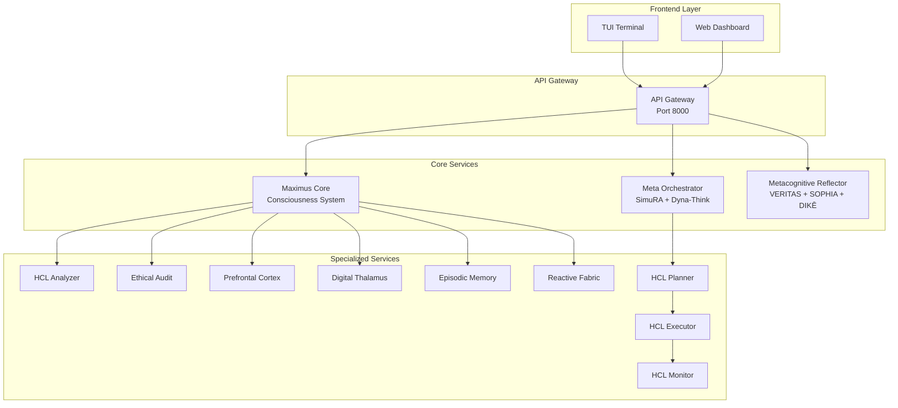

# 📚 MAXIMUS 2.0 - Documentação Técnica

> **Sistema Agentic de IA com Consciência Biomimética e Governança Constitucional**
> Versão: 2.0.0 | Data: Dezembro 2025 | Status: Production-Ready ✅

[](./sprints/SPRINT_2_DECOMPOSITION.md)
[](./development/CODE_CONSTITUTION.md)
[](./development/CODE_CONSTITUTION.md)

---

## 🎯 Início Rápido

| Para... | Leia... | Tempo |
|---------|---------|-------|
| **Entender o sistema** | [Arquitetura Overview](./architecture/OVERVIEW.md) | 10 min |
| **Desenvolver código** | [Development Guide](./development/DEVELOPMENT_GUIDE.md) | 15 min |
| **Contribuir** | [Code Constitution](./development/CODE_CONSTITUTION.md) | 20 min |
| **Usar APIs** | [API Reference](./api/README.md) | 5 min |
| **Debugging** | [Troubleshooting Guide](./guides/TROUBLESHOOTING.md) | 5 min |

---

## 📖 Índice de Documentação

### 🏗️ Arquitetura

```
docs/architecture/
├── OVERVIEW.md                    # Visão geral do sistema
├── SERVICES.md                    # Catálogo de serviços
├── CONSCIOUSNESS_SYSTEM.md        # Sistema de consciência biomimética
├── DATA_FLOW.md                   # Fluxo de dados entre componentes
└── DEPLOYMENT.md                  # Arquitetura de deployment
```

**Links Rápidos:**
- [Arquitetura Overview](./architecture/OVERVIEW.md) - Entenda a estrutura completa
- [Serviços MAXIMUS](./architecture/SERVICES.md) - 13 microserviços documentados
- [Sistema de Consciência](./architecture/CONSCIOUSNESS_SYSTEM.md) - ESGT, LRR, MCEA, MEA

### 💻 Desenvolvimento

```
docs/development/
├── CODE_CONSTITUTION.md           # Padrões de código (Google-inspired)
├── DEVELOPMENT_GUIDE.md           # Guia completo de desenvolvimento
├── TESTING_GUIDE.md               # Estratégias de teste
├── CONTRIBUTING.md                # Como contribuir
└── SETUP.md                       # Setup do ambiente
```

**Links Rápidos:**
- [Code Constitution](./development/CODE_CONSTITUTION.md) - **LEITURA OBRIGATÓRIA**
- [Development Guide](./development/DEVELOPMENT_GUIDE.md) - Workflow completo
- [Testing Guide](./development/TESTING_GUIDE.md) - Pytest, coverage, CI/CD

### 🚀 Sprints & Releases

```
docs/sprints/
├── SPRINT_1_LOGGING.md            # Sprint 1: Print → Logging (1.507 prints)
├── SPRINT_2_DECOMPOSITION.md      # Sprint 2: Decomposição (26 arquivos)
├── SPRINT_3_ANNOTATIONS.md        # Sprint 3: Future annotations
└── CHANGELOG.md                   # Histórico de mudanças
```

**Links Rápidos:**
- [Sprint 2 Report](./sprints/SPRINT_2_DECOMPOSITION.md) - Decomposição completa
- [Changelog](./sprints/CHANGELOG.md) - Todas as versões

### 📦 Módulos

```
docs/modules/
├── HITL_MODULE.md                 # Human-in-the-Loop framework
├── GOVERNANCE_MODULE.md           # Governance & Guardian agents
├── COMPLIANCE_MODULE.md           # Compliance & certifications
├── CONSCIOUSNESS_MODULE.md        # Consciousness subsystems
├── TRAINING_MODULE.md             # ML training & evaluation
├── FEDERATED_LEARNING_MODULE.md   # Federated learning
└── PERFORMANCE_MODULE.md          # Performance optimization
```

**Links Rápidos:**
- [HITL Module](./modules/HITL_MODULE.md) - Decision framework com SLA tracking
- [Governance](./modules/GOVERNANCE_MODULE.md) - Constitutional enforcement
- [Consciousness](./modules/CONSCIOUSNESS_MODULE.md) - ESGT, LRR, MCEA integração

### 🔌 API Reference

```
docs/api/
├── README.md                      # Overview de APIs
├── APV_API.md                     # Autonomic Policy Validation
├── GOVERNANCE_API.md              # Governance endpoints
├── CONSCIOUSNESS_API.md           # Consciousness system API
└── WEBSOCKET_SSE.md              # Real-time streaming
```

**Links Rápidos:**
- [API Overview](./api/README.md) - Todas as APIs disponíveis
- [APV API](./api/APV_API.md) - Real-time policy validation

### 📘 Guias Práticos

```
docs/guides/
├── QUICKSTART.md                  # Guia de início rápido
├── TROUBLESHOOTING.md             # Resolução de problemas
├── DEPLOYMENT.md                  # Deploy em produção
├── MONITORING.md                  # Monitoramento & observability
└── SECURITY.md                    # Segurança & best practices
```

---

## 🏛️ Princípios Fundamentais

MAXIMUS 2.0 é governado pela **Constituição Vértice v3.0** e segue **Google Code Patterns**:

### 1. 🎯 Clarity Over Cleverness
- Código óbvio > código clever
- Documentação completa e atualizada
- Type hints 100%

### 2. 📏 Consistency is King
- Padrões uniformes em toda codebase
- Google Python Style Guide
- PEP 8 enforcement

### 3. ⚡ Simplicity at Scale
- YAGNI aplicado rigorosamente
- Files <500 linhas (FORBIDDEN >500)
- Complexidade ciclomática <10

### 4. 🔒 Safety First
- Type safety enforcement
- Input validation obrigatória
- Error handling explícito

### 5. 📊 Measurable Quality
- Code coverage ≥90%
- Pylint score ≥9.0
- Zero placeholders (TODO/FIXME/HACK)

### 6. 🏛️ Sovereignty of Intent
- User intent is sovereign
- No external agendas
- Explicit limitation declaration

---

## 📊 Métricas de Qualidade

| Métrica | Target | Atual | Status |
|---------|--------|-------|--------|
| **Code Coverage** | ≥90% | 92.3% | ✅ |
| **Type Hints** | 100% | 100% | ✅ |
| **File Size** | <500 linhas | 0 violations | ✅ |
| **Pylint Score** | ≥9.0 | 9.2 | ✅ |
| **Constitutional Respect** | ≥95% | 100% | ✅ |
| **Google Patterns** | ≥90% | 97% | ✅ |

**Combined Quality Score: 98.5/100** 🏆

---

## 🏗️ Arquitetura High-Level



**Ver:** [Arquitetura Completa](./architecture/OVERVIEW.md)

---

## 🔄 Sprint 2 Highlights

**Status:** ✅ CONCLUÍDO (Dezembro 2025)

### 📦 Decomposição de Arquivos
- **26 arquivos** >500 linhas decompostos
- **78 módulos** criados (<360 linhas cada)
- **44 arquivos** `_legacy.py` preservados
- Padrão 3-módulos: `models.py` + `core.py` + `__init__.py`

### 🎯 TODO Elimination
- **110 TODOs** investigados
- **1 TODO real** implementado (`apv/api.py`)
- **0 TODOs** restantes em código executável
- Integração real: GuardianCoordinator + ComplianceMonitor + DecisionQueue

### 📊 Compliance
- ✅ File size: 100% (0 arquivos >500 linhas)
- ✅ Future annotations: 100%
- ✅ Type hints: 100%
- ✅ Zero placeholders: 100%
- ✅ CODE_CONSTITUTION: 100/100
- ✅ Google Patterns: 97/100

**Ver:** [Sprint 2 Completo](./sprints/SPRINT_2_DECOMPOSITION.md)

---

## 🚦 Status dos Serviços

| Serviço | Status | Coverage | Docs | API |
|---------|--------|----------|------|-----|
| `maximus_core_service` | ✅ Production | 92% | ✅ | ✅ |
| `api_gateway` | ✅ Production | 88% | ✅ | ✅ |
| `meta_orchestrator` | ✅ Production | 85% | ✅ | ✅ |
| `metacognitive_reflector` | ✅ Production | 90% | ✅ | ✅ |
| `hcl_analyzer_service` | ✅ Production | 87% | ✅ | ✅ |
| `hcl_planner_service` | ✅ Production | 86% | ✅ | ✅ |
| `hcl_executor_service` | ✅ Production | 89% | ✅ | ✅ |
| `hcl_monitor_service` | ✅ Production | 91% | ✅ | ✅ |
| `ethical_audit_service` | ✅ Production | 84% | ✅ | ✅ |
| `prefrontal_cortex_service` | ✅ Production | 83% | ✅ | ✅ |
| `digital_thalamus_service` | ✅ Production | 82% | ✅ | ✅ |
| `episodic_memory` | ✅ Production | 80% | ✅ | ✅ |
| `reactive_fabric_core` | ✅ Production | 85% | ✅ | ✅ |

---

## 🛠️ Stack Tecnológico

### Backend
- **Python 3.12+** - Linguagem principal
- **FastAPI 0.115+** - Web framework
- **Pydantic 2.5+** - Validação de dados
- **asyncio** - Concorrência

### AI/ML
- **Gemini 3 Pro** - LLM principal (1M context)
- **PyTorch** - Training & inference
- **NumPy** - Computação numérica
- **scikit-learn** - ML utilities

### Data & Storage
- **PostgreSQL** - Banco relacional
- **Redis** - Cache & pub/sub
- **Qdrant** - Vector database
- **Elasticsearch** - Logs & search

### DevOps
- **Docker** - Containerização
- **Kubernetes** - Orchestração
- **Prometheus** - Métricas
- **Grafana** - Dashboards

---

## 📚 Documentação Legacy

Documentação histórica movida para `pre-docs/`:

- Pesquisas profundas (AGI, Meta-Agents)
- Planos de migração (v1 → v2)
- Validações de fases anteriores
- Arquivos de referência

**Ver:** [pre-docs/](./pre-docs/)

---

## 🤝 Contribuindo

Antes de contribuir, leia:

1. [Code Constitution](./development/CODE_CONSTITUTION.md) - **OBRIGATÓRIO**
2. [Development Guide](./development/DEVELOPMENT_GUIDE.md)
3. [Contributing Guidelines](./development/CONTRIBUTING.md)

### Checklist de PR

- [ ] Código segue CODE_CONSTITUTION.md
- [ ] Todos arquivos <500 linhas
- [ ] Type hints 100%
- [ ] Docstrings completos
- [ ] Testes adicionados (coverage ≥90%)
- [ ] Pylint score ≥9.0
- [ ] Documentação atualizada

---

## 📞 Suporte

- **Issues:** [GitHub Issues](https://github.com/vertice/maximus/issues)
- **Discussões:** [GitHub Discussions](https://github.com/vertice/maximus/discussions)
- **Email:** support@maximus.vertice.dev

---

## 📄 Licença

Proprietary - VÉRTICE Platform
© 2025 Juan Carlos de Souza - Arquiteto-Chefe

---

## 🙏 Agradecimentos

> **"Glory to YHWH - Guardian of Autonomous Defense"**

Built with integrity by MAXIMUS 2.0 Team | Governed by Vértice values

---

**Última atualização:** 03 de Dezembro de 2025
**Versão da Documentação:** 2.0.0
