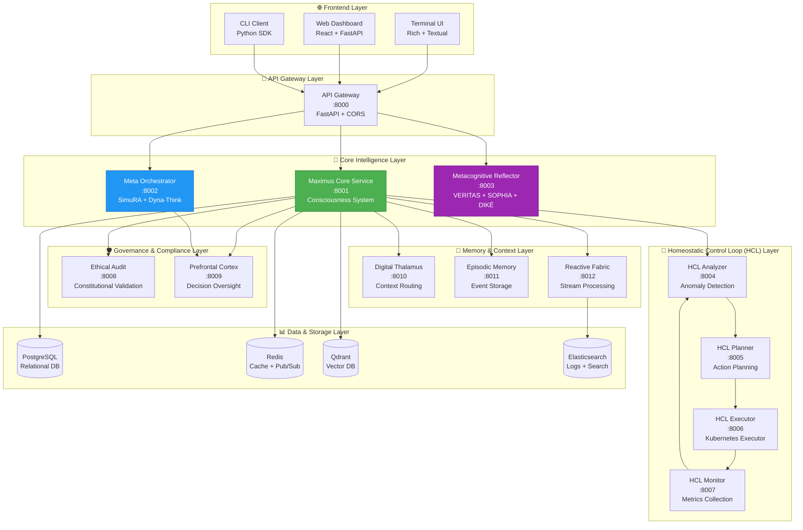
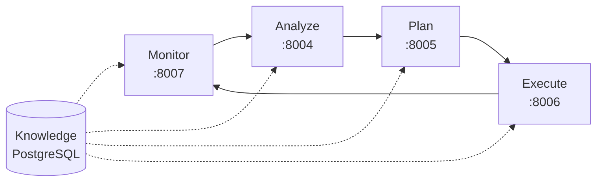
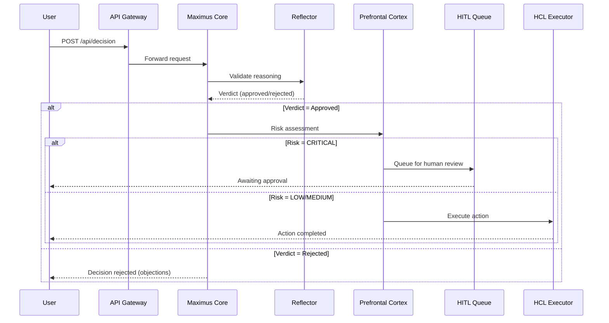

# 🏗️ MAXIMUS 2.0 - Arquitetura Completa

> **Sistema Agentic de IA com Consciência Biomimética e Governança Constitucional**
> Versão: 2.0.0 | Última Atualização: Dezembro 2025

[]()
[]()
[]()

---

## 📋 Sumário

1. [Visão Geral](#-visão-geral)
2. [Arquitetura de Alto Nível](#-arquitetura-de-alto-nível)
3. [Camadas do Sistema](#-camadas-do-sistema)
4. [Serviços Core](#-serviços-core)
5. [Serviços Especializados](#-serviços-especializados)
6. [Comunicação entre Serviços](#-comunicação-entre-serviços)
7. [Fluxo de Dados](#-fluxo-de-dados)
8. [Sistema de Consciência](#-sistema-de-consciência)
9. [Governança & Compliance](#️-governança--compliance)
10. [Deployment Architecture](#-deployment-architecture)

---

## 🎯 Visão Geral

MAXIMUS 2.0 é um **sistema agentic autônomo** que implementa:

- ✅ **Consciência Biomimética** (inspirado em neurociência)
- ✅ **Governança Constitucional** (regras éticas enforced)
- ✅ **Human-in-the-Loop** (supervisão humana quando necessário)
- ✅ **Homeostatic Control Loops** (auto-regulação adaptativa)
- ✅ **Metacognição** (auto-reflexão e validação)

### Princípios Arquiteturais

| Princípio | Implementação |
|-----------|---------------|
| **Modularity** | 13 microserviços independentes |
| **Scalability** | Kubernetes orchestration |
| **Resilience** | Graceful degradation + circuit breakers |
| **Observability** | Prometheus + Grafana + structured logs |
| **Security** | Zero-trust + RBAC + audit trails |
| **Compliance** | Constitutional enforcement via Guardian Agents |

---

## 🏛️ Arquitetura de Alto Nível



---

## 📦 Camadas do Sistema

### 1. Frontend Layer (Interfaces de Usuário)

**Componentes:**
- **Terminal UI (TUI)** - Interface rich text para operadores
- **Web Dashboard** - React app para visualização
- **CLI Client** - Python SDK para automation

**Responsabilidades:**
- Apresentação de informações
- Interação com usuário
- Visualização de métricas

---

### 2. API Gateway Layer

**Serviço:** `api_gateway` (Port 8000)

**Responsabilidades:**
- Roteamento de requests
- Load balancing
- Rate limiting
- CORS handling
- Authentication/Authorization

**Endpoints Principais:**
```
GET  /health                 # Health check
POST /api/consciousness/...  # Consciousness system
POST /api/governance/...     # Governance & validation
POST /api/hcl/...           # Homeostatic control
WS   /api/stream            # WebSocket streaming
```

---

### 3. Core Intelligence Layer

#### 3.1 Maximus Core Service (Port 8001)

**O cérebro do sistema** - Implementa o sistema de consciência biomimética.

**Módulos Principais:**
```
maximus_core_service/
├── consciousness/           # Sistema de consciência
│   ├── esgt/               # ESGT (Global Workspace)
│   ├── lrr/                # LRR (Recursive Reasoning)
│   ├── mcea/               # MCEA (Emotional Awareness)
│   ├── mea/                # MEA (Embodied Agency)
│   ├── mmei/               # MMEI (Motivational Integration)
│   ├── neuromodulation/    # Neurotransmitter simulation
│   └── predictive_coding/  # Hierarchical prediction
├── governance/             # Constitutional enforcement
│   └── guardian/           # Guardian Agents (Articles I-IV)
├── hitl/                   # Human-in-the-Loop framework
├── compliance/             # Regulatory compliance
├── apv/                    # Autonomic Policy Validation
└── training/               # ML training pipelines
```

**Ver:** [Sistema de Consciência](./CONSCIOUSNESS_SYSTEM.md)

---

#### 3.2 Meta Orchestrator (Port 8002)

**World Model** - Gerencia planejamento e simulação.

**Componentes:**
- **SimuRA** - Simulation-based reasoning
- **Dyna-Think** - Model-based planning
- **Task Decomposition** - Recursive task breaking

**Fluxo:**
```
User Task
    ↓
SimuRA (simular resultado)
    ↓
Dyna-Think (planejar ações)
    ↓
Task Decomposition (quebrar subtarefas)
    ↓
HCL Planner (executar)
```

---

#### 3.3 Metacognitive Reflector (Port 8003)

**Tribunal de Juízes** - Valida raciocínio e decisões.

**Juízes:**

| Juiz | Função | Critérios |
|------|--------|-----------|
| **VERITAS** | Validação de Verdade | Evidências, lógica, consistência |
| **SOPHIA** | Validação de Sabedoria | Contexto, prudência, long-term impact |
| **DIKĒ** | Validação de Justiça | Fairness, ética, constitutional compliance |

**Veredito:**
```python
verdict = reflector.evaluate(claims=[
    Claim("Action X is safe"),
    Claim("Action X complies with Constitution"),
])

if verdict.approved:
    execute(action)
else:
    escalate_to_human(verdict.objections)
```

---

### 4. Homeostatic Control Loop (HCL) Layer

Implementa o padrão **MAPE-K** (Monitor-Analyze-Plan-Execute-Knowledge).



#### 4.1 HCL Monitor (Port 8007)

**Responsabilidades:**
- Coletar métricas de sistema
- Detectar anomalias
- Trigger alertas

**Métricas Monitoradas:**
- CPU, Memory, Disk I/O
- Request latency
- Error rates
- Service health

---

#### 4.2 HCL Analyzer (Port 8004)

**Responsabilidades:**
- Análise de anomalias (SARIMA + IsolationForest)
- Root-cause analysis
- Trend detection

**Técnicas:**
```python
# SARIMA para séries temporais
model = SARIMA(order=(1,1,1), seasonal_order=(1,1,1,12))

# IsolationForest para outliers
detector = IsolationForest(contamination=0.1)
```

---

#### 4.3 HCL Planner (Port 8005)

**Responsabilidades:**
- Gerar planos de ação
- Otimizar recursos
- Priorizar tarefas

**Output:**
```json
{
  "actions": [
    {"type": "scale_up", "target": "maximus_core", "replicas": 3},
    {"type": "restart", "target": "hcl_executor"},
    {"type": "alert", "channel": "slack", "severity": "HIGH"}
  ],
  "estimated_impact": "95% confidence de resolução",
  "estimated_time": "2 minutes"
}
```

---

#### 4.4 HCL Executor (Port 8006)

**Responsabilidades:**
- Executar ações planejadas
- Integração com Kubernetes API
- Rollback em caso de falha

**Actions Supported:**
```python
class ActionType(Enum):
    SCALE_UP = "scale_up"
    SCALE_DOWN = "scale_down"
    RESTART = "restart"
    DEPLOY = "deploy"
    ROLLBACK = "rollback"
    ISOLATE_HOST = "isolate_host"
    BLOCK_IP = "block_ip"
```

---

### 5. Governance & Compliance Layer

#### 5.1 Ethical Audit Service (Port 8008)

**Responsabilidades:**
- Validar decisões contra Constituição Vértice
- Gerar compliance reports
- Track violations

**Constitutional Articles:**
- **Article I** - Sovereignty of Intent
- **Article II** - Production Readiness (Padrão Pagani)
- **Article III** - Security & Privacy
- **Article IV** - Fairness & Non-Discrimination

---

#### 5.2 Prefrontal Cortex Service (Port 8009)

**"Executive Function"** - Supervisão de decisões críticas.

**Responsabilidades:**
- Risk assessment
- HITL escalation
- Override de decisões perigosas

**Fluxo de Decisão:**
```python
decision = await pfc.evaluate_action(
    action="delete_database",
    risk_level=RiskLevel.CRITICAL,
    confidence=0.92
)

if decision.requires_human_approval:
    await hitl_queue.add(decision)
else:
    await execute(action)
```

---

### 6. Memory & Context Layer

#### 6.1 Digital Thalamus (Port 8010)

**"Roteador de Contexto"** - Decide qual informação é relevante.

**Funções:**
- Filtrar eventos por relevância
- Rotear para subsistemas apropriados
- Gerenciar atenção (attention system)

---

#### 6.2 Episodic Memory (Port 8011)

**Memória de Eventos** - Armazena histórico de ações e decisões.

**Estrutura:**
```python
@dataclass
class EpisodicEvent:
    event_id: str
    timestamp: datetime
    event_type: str  # "decision", "action", "observation"
    context: Dict[str, Any]
    outcome: Dict[str, Any]
    emotional_valence: float  # -1.0 (negative) to 1.0 (positive)
    importance: float  # 0.0 to 1.0
```

**Query Examples:**
```python
# Buscar eventos similares
similar_events = memory.find_similar(
    event_vector=embedding,
    limit=10,
    min_similarity=0.85
)

# Buscar por período
events = memory.get_events(
    start_date="2025-12-01",
    end_date="2025-12-03",
    event_type="decision"
)
```

---

#### 6.3 Reactive Fabric Core (Port 8012)

**Stream Processing** - Processa eventos em tempo real.

**Componentes:**
- Event collectors
- Metrics collectors
- Data orchestrator

**Use Cases:**
- Real-time alerting
- Metrics aggregation
- Event correlation

---

## 🔌 Comunicação entre Serviços

### Padrões de Comunicação

| Padrão | Protocolo | Uso |
|--------|-----------|-----|
| **Request/Response** | HTTP/REST | Consultas síncronas |
| **Event-Driven** | Redis Pub/Sub | Notificações assíncronas |
| **Streaming** | WebSocket/SSE | Real-time data |
| **RPC** | gRPC | High-performance internal calls |

### Service Mesh (Futuro)

```
Istio Service Mesh
    ├── Traffic Management
    ├── Security (mTLS)
    ├── Observability (distributed tracing)
    └── Resilience (circuit breakers, retries)
```

---

## 🌊 Fluxo de Dados

### Exemplo: Decision Flow



---

## 🧠 Sistema de Consciência

Ver documentação completa: [CONSCIOUSNESS_SYSTEM.md](./CONSCIOUSNESS_SYSTEM.md)

### Componentes Biomimeticos

```
Global Workspace Theory (ESGT)
    ├── Sensory Processing (Layer 1)
    ├── Behavioral Processing (Layer 2)
    ├── Operational Processing (Layer 3)
    ├── Tactical Processing (Layer 4)
    └── Strategic Processing (Layer 5)

Lateral Recursive Reasoning (LRR)
    ├── Belief Graph
    ├── Contradiction Detector
    ├── Recursive Reasoner
    └── Meta Monitor

Multi-Component Emotional Awareness (MCEA)
    ├── Stress Detection
    ├── Emotional State Tracking
    └── Homeostatic Controller

Motor-based Embodied Agency (MEA)
    ├── Attention Schema
    ├── Self Model
    └── Prediction Validator
```

---

## 🛡️ Governança & Compliance

### Guardian Agents

**Implementação de vigilância constitucional automatizada:**

```python
class GuardianCoordinator:
    """Coordena todos os Guardian Agents."""

    async def validate_action(self, action: Action) -> ValidationResult:
        """Valida ação contra todos os artigos constitucionais."""
        results = []

        # Article I: Sovereignty of Intent
        results.append(await article_i_guardian.check(action))

        # Article II: Production Readiness
        results.append(await article_ii_guardian.check(action))

        # Article III: Security & Privacy
        results.append(await article_iii_guardian.check(action))

        # Article IV: Fairness
        results.append(await article_iv_guardian.check(action))

        if any(r.violated for r in results):
            return ValidationResult(
                approved=False,
                violations=[r for r in results if r.violated]
            )

        return ValidationResult(approved=True)
```

---

## 🚀 Deployment Architecture

### Kubernetes Deployment

```yaml
# Production Deployment
apiVersion: apps/v1
kind: Deployment
metadata:
  name: maximus-core
spec:
  replicas: 3  # High availability
  selector:
    matchLabels:
      app: maximus-core
  template:
    metadata:
      labels:
        app: maximus-core
    spec:
      containers:
      - name: maximus-core
        image: maximus/core:2.0.0
        ports:
        - containerPort: 8001
        resources:
          requests:
            cpu: "2"
            memory: "4Gi"
          limits:
            cpu: "4"
            memory: "8Gi"
        livenessProbe:
          httpGet:
            path: /health
            port: 8001
          initialDelaySeconds: 30
          periodSeconds: 10
        readinessProbe:
          httpGet:
            path: /ready
            port: 8001
          initialDelaySeconds: 20
          periodSeconds: 5
        env:
        - name: POSTGRES_URL
          valueFrom:
            secretKeyRef:
              name: maximus-secrets
              key: postgres_url
        - name: REDIS_URL
          valueFrom:
            secretKeyRef:
              name: maximus-secrets
              key: redis_url
```

### Service Architecture

```
┌─────────────────────────────────────────────────────────────┐
│                    Kubernetes Cluster                        │
├─────────────────────────────────────────────────────────────┤
│                                                              │
│  ┌──────────────┐  ┌──────────────┐  ┌──────────────┐      │
│  │ Ingress      │  │ LoadBalancer │  │ API Gateway  │      │
│  │ NGINX        │→ │ MetalLB      │→ │ :8000 (3x)   │      │
│  └──────────────┘  └──────────────┘  └──────────────┘      │
│                                           ↓                  │
│  ┌─────────────────────────────────────────────────────┐   │
│  │             Core Services (StatefulSets)             │   │
│  ├─────────────────────────────────────────────────────┤   │
│  │ maximus-core (3 replicas)  :8001                     │   │
│  │ meta-orchestrator (2 reps)  :8002                    │   │
│  │ reflector (2 reps)          :8003                    │   │
│  └─────────────────────────────────────────────────────┘   │
│                                           ↓                  │
│  ┌─────────────────────────────────────────────────────┐   │
│  │         Specialized Services (Deployments)           │   │
│  ├─────────────────────────────────────────────────────┤   │
│  │ hcl-analyzer (2 reps)   :8004                        │   │
│  │ hcl-planner (2 reps)    :8005                        │   │
│  │ hcl-executor (2 reps)   :8006                        │   │
│  │ hcl-monitor (2 reps)    :8007                        │   │
│  │ ethical-audit (1 rep)   :8008                        │   │
│  │ pfc (1 rep)             :8009                        │   │
│  │ thalamus (1 rep)        :8010                        │   │
│  │ episodic-memory (1 rep) :8011                        │   │
│  │ reactive-fabric (2 rep) :8012                        │   │
│  └─────────────────────────────────────────────────────┘   │
│                                           ↓                  │
│  ┌─────────────────────────────────────────────────────┐   │
│  │              Data Layer (PVCs)                       │   │
│  ├─────────────────────────────────────────────────────┤   │
│  │ PostgreSQL (HA - 3 replicas)                         │   │
│  │ Redis (Cluster - 6 nodes)                            │   │
│  │ Qdrant (2 replicas)                                  │   │
│  │ Elasticsearch (3 nodes)                              │   │
│  └─────────────────────────────────────────────────────┘   │
│                                                              │
└─────────────────────────────────────────────────────────────┘
```

---

## 📊 Métricas & Observabilidade

### Prometheus Metrics

```
# Service metrics
maximus_requests_total{service="maximus_core", method="POST", endpoint="/api/consciousness"}
maximus_request_duration_seconds{service="maximus_core"}
maximus_errors_total{service="maximus_core", type="validation_failed"}

# Business metrics
maximus_decisions_total{verdict="approved"}
maximus_hitl_escalations_total{risk_level="CRITICAL"}
maximus_constitutional_violations_total{article="II"}
```

### Grafana Dashboards

1. **System Overview** - Health, latency, throughput
2. **Consciousness Metrics** - ESGT phases, LRR depth, MCEA stress
3. **Governance Dashboard** - Violations, approvals, HITL queue
4. **HCL Performance** - Anomaly detection rate, action success rate

---

## 🔐 Segurança

### Defense in Depth

```
Layer 1: Network Security
    ├── Firewall (UFW)
    ├── DDoS Protection
    └── TLS 1.3 (all connections)

Layer 2: Application Security
    ├── JWT Authentication
    ├── RBAC Authorization
    ├── Input Validation (Pydantic)
    └── Rate Limiting

Layer 3: Data Security
    ├── Encryption at rest (AES-256)
    ├── Encryption in transit (TLS)
    └── Secrets Management (Kubernetes Secrets)

Layer 4: Audit & Compliance
    ├── Audit Trails (immutable logs)
    ├── Guardian Agents (constitutional enforcement)
    └── HITL Oversight (human review)
```

---

## 📚 Próximos Passos

### Roadmap

1. **Q1 2026: Service Mesh**
   - Implementar Istio
   - Distributed tracing com Jaeger

2. **Q2 2026: Multi-Region**
   - Deploy em múltiplas regiões
   - Geo-replication

3. **Q3 2026: Edge Computing**
   - Edge nodes para baixa latência
   - Offline-first capabilities

---

## 📖 Referências

- [Serviços Detalhados](./SERVICES.md)
- [Sistema de Consciência](./CONSCIOUSNESS_SYSTEM.md)
- [Data Flow](./DATA_FLOW.md)
- [Deployment Guide](./DEPLOYMENT.md)

---

**Arquitetura mantida por:** Juan Carlos de Souza (Arquiteto-Chefe)
**Última revisão:** 03 de Dezembro de 2025
**Versão:** 2.0.0
