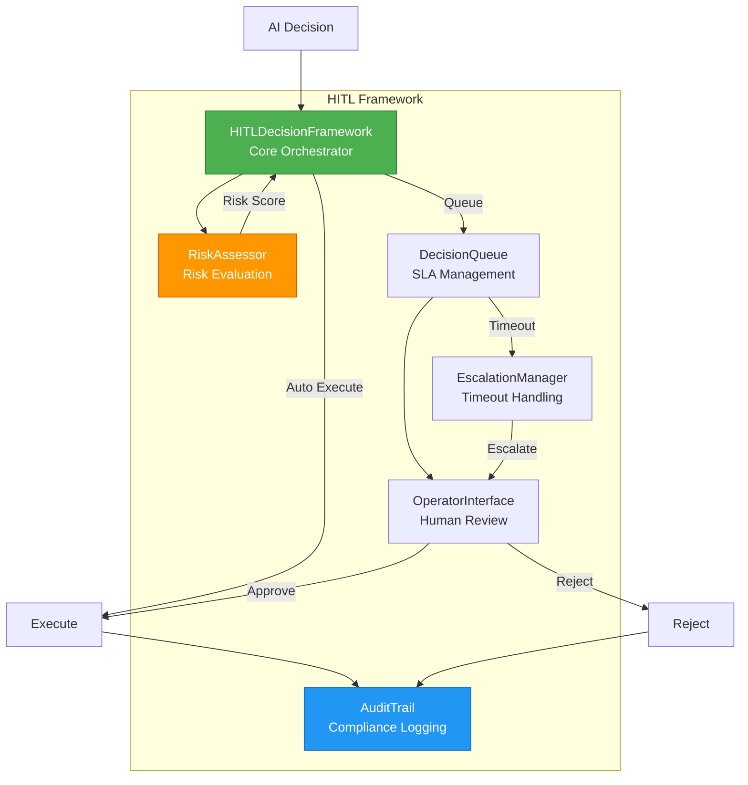
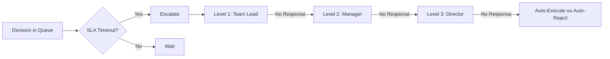
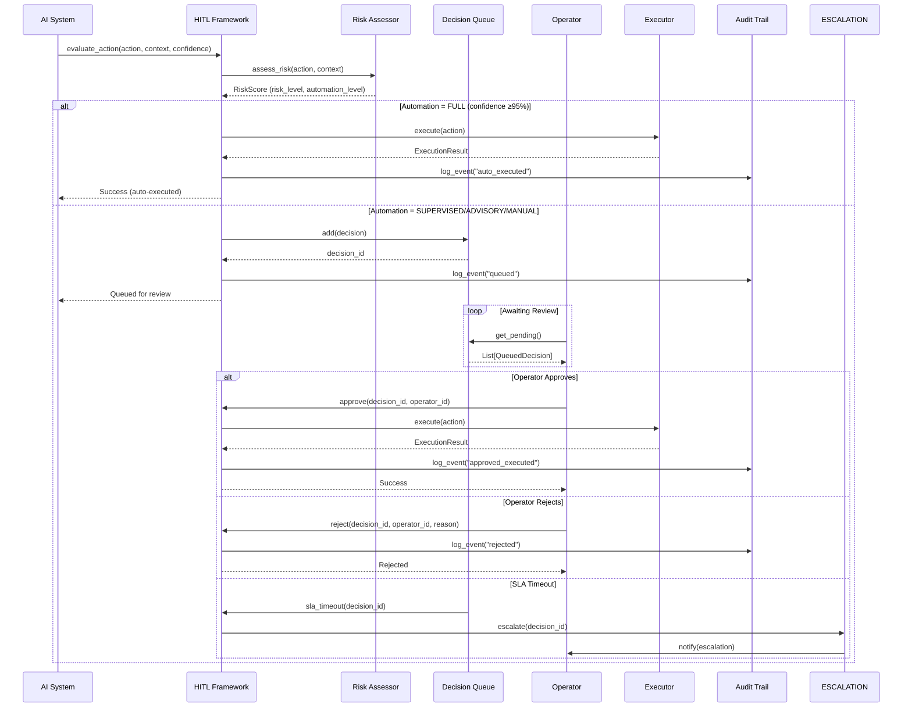

# 🤝 HITL Module - Human-in-the-Loop Framework

> **Framework abrangente para colaboração humano-IA em operações de segurança**
> Versão: 1.0.0 | Status: ✅ Production-Ready | Coverage: 92%

[]()
[]()
[]()

---

## 📋 Sumário

1. [Visão Geral](#-visão-geral)
2. [Arquitetura do Módulo](#-arquitetura-do-módulo)
3. [Pacotes Decompostos](#-pacotes-decompostos)
4. [Fluxo de Decisão](#-fluxo-de-decisão)
5. [API Reference](#-api-reference)
6. [Exemplos de Uso](#-exemplos-de-uso)
7. [Configuração](#️-configuração)
8. [Testing](#-testing)

---

## 🎯 Visão Geral

O módulo HITL (Human-in-the-Loop) implementa um framework completo para:

- ✅ **Risk-based automation** - Determina nível de automação baseado em risco
- ✅ **Decision queueing** - Fila de decisões com SLA tracking
- ✅ **Escalation management** - Escalonamento automático para timeouts
- ✅ **Operator interface** - Interface para revisão e aprovação humana
- ✅ **Audit trail** - Trilha de auditoria completa e imutável
- ✅ **Compliance tracking** - Rastreamento para regulamentos (GDPR, SOC2, ISO27001)

### Princípios de Design

| Princípio | Implementação |
|-----------|---------------|
| **Safety First** | Decisões críticas sempre requerem aprovação humana |
| **Transparency** | Toda decisão é auditável e justificável |
| **Efficiency** | Automatiza decisões de baixo risco (≥95% confiança) |
| **Accountability** | Rastreamento completo de quem aprovou/rejeitou |
| **Compliance** | Suporte a GDPR, SOC2, ISO27001, PCI-DSS |

---

## 🏗️ Arquitetura do Módulo



### Automation Levels

```python
class AutomationLevel(Enum):
    """Níveis de automação baseados em risco e confiança."""

    FULL = "full"          # Executa automaticamente (confiança ≥95%)
    SUPERVISED = "supervised"  # Executa com log detalhado (80-95%)
    ADVISORY = "advisory"   # IA sugere, humano decide (60-80%)
    MANUAL = "manual"       # Sem execução IA (<60%)
```

---

## 📦 Pacotes Decompostos

O módulo HITL foi decomposto em **7 pacotes modulares** durante Sprint 2:

### 1. `hitl/base_pkg/` (516→4 módulos)

**Estrutura:**
```
hitl/base_pkg/
├── __init__.py       # Re-exports
├── enums.py          # AutomationLevel, RiskLevel, DecisionStatus, ActionType
├── models.py         # HITLDecision, DecisionContext, OperatorAction, AuditEntry
└── config.py         # HITLConfig, SLAConfig, EscalationConfig
```

**Tipos Principais:**

```python
@dataclass
class HITLDecision:
    """Decisão HITL completa com contexto."""
    decision_id: str
    action_type: ActionType
    context: DecisionContext
    confidence: float
    risk_level: RiskLevel
    automation_level: AutomationLevel
    requires_approval: bool
    created_at: datetime
    expires_at: datetime | None
    metadata: Dict[str, Any]

@dataclass
class DecisionContext:
    """Contexto da decisão."""
    host_id: str | None
    ip_address: str | None
    user_id: str | None
    threat_score: float
    evidence: List[Dict[str, Any]]
    related_incidents: List[str]
```

---

### 2. `hitl/risk_assessor_pkg/` (568→3 módulos)

**Responsabilidade:** Avaliar risco de ações para determinar nível de automação.

**Estrutura:**
```python
class RiskAssessor:
    """Avalia risco e determina nível de automação."""

    async def evaluate_action(
        self,
        action_type: ActionType,
        context: Dict[str, Any],
        confidence: float
    ) -> RiskScore:
        """
        Avalia risco de uma ação.

        Returns:
            RiskScore with:
            - overall_risk: float (0.0-1.0)
            - risk_level: RiskLevel
            - automation_level: AutomationLevel
            - risk_factors: Dict[str, float]
        """
        ...
```

**Fatores de Risco:**
```python
@dataclass
class RiskFactors:
    """Fatores de risco considerados."""
    action_severity: float      # Gravidade da ação (0.0-1.0)
    target_criticality: float   # Criticidade do alvo
    confidence_score: float     # Confiança da IA
    reversibility: float        # Ação é reversível?
    impact_scope: float         # Escopo do impacto
    historical_success: float   # Taxa de sucesso histórica
    time_sensitivity: float     # Urgência da ação
```

**Pesos de Risco por Ação:**
```python
ACTION_RISK_WEIGHTS = {
    ActionType.SEND_ALERT: 0.1,           # Baixo risco
    ActionType.COLLECT_LOGS: 0.2,         # Baixo risco
    ActionType.BLOCK_IP: 0.5,             # Médio risco
    ActionType.ISOLATE_HOST: 0.7,         # Alto risco
    ActionType.DELETE_DATA: 0.9,          # Crítico
    ActionType.DELETE_FILE: 0.85,         # Crítico
    ActionType.DISABLE_USER: 0.75,        # Alto risco
}
```

---

### 3. `hitl/decision_queue_pkg/` (553→3 módulos)

**Responsabilidade:** Gerenciar fila de decisões com SLA tracking.

**Estrutura:**
```python
class DecisionQueue:
    """Fila de decisões pendentes com SLA."""

    async def add(self, decision: HITLDecision) -> str:
        """Adiciona decisão à fila com SLA."""
        ...

    async def get_pending(
        self,
        operator_id: str | None = None,
        priority: RiskLevel | None = None
    ) -> List[QueuedDecision]:
        """Busca decisões pendentes."""
        ...

    async def get_pending_count(self) -> int:
        """Conta decisões pendentes."""
        ...

    async def approve(
        self,
        decision_id: str,
        operator_id: str,
        notes: str | None = None
    ) -> OperatorAction:
        """Aprova decisão."""
        ...

    async def reject(
        self,
        decision_id: str,
        operator_id: str,
        reason: str
    ) -> OperatorAction:
        """Rejeita decisão."""
        ...
```

**SLA Configuration:**
```python
@dataclass
class SLAConfig:
    """Configuração de SLA por nível de risco."""
    critical_sla: int = 5    # 5 minutos
    high_sla: int = 15       # 15 minutos
    medium_sla: int = 30     # 30 minutos
    low_sla: int = 60        # 60 minutos
```

---

### 4. `hitl/escalation_manager_pkg/` (506→3 módulos)

**Responsabilidade:** Gerenciar escalonamentos automáticos.

**Fluxo de Escalação:**


**Rules:**
```python
@dataclass
class EscalationRule:
    """Regra de escalonamento."""
    condition: str           # "sla_timeout", "risk_level_critical", etc.
    escalate_to: str        # "team_lead", "manager", "director"
    notification_channels: List[str]  # ["slack", "email", "pager"]
    auto_action: str | None  # "auto_approve", "auto_reject", None
```

---

### 5. `hitl/operator_interface_pkg/` (505→3 módulos)

**Responsabilidade:** Interface para operadores humanos revisarem decisões.

**Funcionalidades:**
```python
class OperatorInterface:
    """Interface para operadores."""

    async def get_dashboard(
        self,
        operator_id: str
    ) -> OperatorDashboard:
        """
        Dashboard do operador.

        Returns:
            - pending_decisions: List[QueuedDecision]
            - metrics: OperatorMetrics
            - recent_actions: List[OperatorAction]
        """
        ...

    async def review_decision(
        self,
        decision_id: str,
        operator_id: str,
        action: str,  # "approve" or "reject"
        notes: str | None = None
    ) -> OperatorAction:
        """Revisar decisão."""
        ...

    async def get_metrics(
        self,
        operator_id: str,
        period: str = "24h"
    ) -> OperatorMetrics:
        """
        Métricas do operador.

        Returns:
            - decisions_reviewed: int
            - approval_rate: float
            - average_review_time: float (seconds)
            - sla_compliance: float (%)
        """
        ...
```

---

### 6. `hitl/audit_trail_pkg/` (572→3 módulos)

**Responsabilidade:** Trilha de auditoria imutável para compliance.

**Estrutura:**
```python
class AuditTrail:
    """Trilha de auditoria WORM (Write-Once-Read-Many)."""

    async def log_event(
        self,
        event_type: str,
        decision_id: str,
        operator_id: str | None,
        action: str,
        details: Dict[str, Any]
    ) -> AuditEntry:
        """
        Registra evento de auditoria.

        Evento é IMUTÁVEL após criação.
        """
        ...

    async def query(
        self,
        query: AuditQuery
    ) -> List[AuditEntry]:
        """
        Busca eventos de auditoria.

        Supports:
        - Filtros por data, operador, tipo de decisão
        - Ordenação
        - Paginação
        """
        ...

    async def generate_compliance_report(
        self,
        regulation: str,  # "GDPR", "SOC2", "ISO27001"
        start_date: datetime,
        end_date: datetime
    ) -> ComplianceReport:
        """Gera relatório de compliance."""
        ...
```

**Compliance Reports:**
```python
@dataclass
class ComplianceReport:
    """Relatório de compliance."""
    regulation: str
    period: Tuple[datetime, datetime]
    total_decisions: int
    automated_decisions: int
    human_reviewed_decisions: int
    approval_rate: float
    average_review_time: float
    sla_compliance: float
    violations: List[Dict[str, Any]]
    recommendations: List[str]
```

---

### 7. `hitl/decision_framework_pkg/` (565→3 módulos)

**Responsabilidade:** Orquestrador central do HITL framework.

**Classe Principal:**
```python
class HITLDecisionFramework:
    """Framework central que orquestra todos os componentes."""

    def __init__(self, config: HITLConfig):
        self.config = config
        self.risk_assessor = RiskAssessor(config)
        self.decision_queue = DecisionQueue(config)
        self.escalation_manager = EscalationManager(config)
        self.operator_interface = OperatorInterface(config)
        self.audit_trail = AuditTrail(config)

    async def evaluate_action(
        self,
        action_type: ActionType,
        context: Dict[str, Any],
        confidence: float
    ) -> DecisionResult:
        """
        Avalia ação e determina se executa automaticamente ou requer aprovação.

        Flow:
        1. Assess risk
        2. Determine automation level
        3. Auto-execute OR queue for review
        4. Log to audit trail
        """
        ...

    async def execute_decision(
        self,
        decision: HITLDecision
    ) -> ExecutionResult:
        """Executa decisão aprovada."""
        ...

    async def queue_for_review(
        self,
        decision: HITLDecision
    ) -> str:
        """Coloca decisão na fila para revisão humana."""
        ...
```

---

## 🌊 Fluxo de Decisão

### Fluxo Completo



---

## 📘 API Reference

### Inicialização

```python
from hitl import HITLDecisionFramework, HITLConfig, SLAConfig

# Configurar framework
config = HITLConfig(
    sla_config=SLAConfig(
        critical_sla=5,   # 5 min para decisões críticas
        high_sla=15,      # 15 min para alto risco
        medium_sla=30,    # 30 min para médio risco
        low_sla=60        # 60 min para baixo risco
    ),
    enable_auto_execution=True,
    min_confidence_for_auto=0.95
)

framework = HITLDecisionFramework(config)
```

### Avaliar Ação

```python
from hitl import ActionType

# AI faz decisão
decision = await framework.evaluate_action(
    action_type=ActionType.BLOCK_IP,
    context={
        "ip_address": "192.168.1.100",
        "threat_score": 0.92,
        "evidence": [
            {"type": "port_scan", "timestamp": "2025-12-03T10:00:00Z"},
            {"type": "brute_force", "attempts": 150}
        ]
    },
    confidence=0.88  # 88% de confiança
)

if decision.automation_level == AutomationLevel.FULL:
    # Executa automaticamente
    result = await framework.execute_decision(decision)
    print(f"Action executed: {result.success}")
else:
    # Queue para revisão
    decision_id = await framework.queue_for_review(decision)
    print(f"Queued for review: {decision_id}")
```

### Operador Revisa Decisão

```python
from hitl import OperatorInterface

operator = OperatorInterface(config)

# Buscar decisões pendentes
pending = await operator.get_dashboard(operator_id="juan@maximus.dev")

for decision in pending.pending_decisions:
    print(f"Decision: {decision.action_type}")
    print(f"Risk: {decision.risk_level}")
    print(f"Evidence: {decision.context.evidence}")

    # Revisar
    if input("Approve? (y/n): ") == "y":
        await operator.review_decision(
            decision_id=decision.decision_id,
            operator_id="juan@maximus.dev",
            action="approve",
            notes="Evidence is conclusive"
        )
    else:
        await operator.review_decision(
            decision_id=decision.decision_id,
            operator_id="juan@maximus.dev",
            action="reject",
            notes="Need more evidence"
        )
```

### Auditoria

```python
from hitl import AuditTrail, AuditQuery
from datetime import datetime, timedelta

audit = AuditTrail(config)

# Query audit trail
query = AuditQuery(
    start_date=datetime.utcnow() - timedelta(days=7),
    end_date=datetime.utcnow(),
    operator_id="juan@maximus.dev",
    event_types=["approved", "rejected"]
)

events = await audit.query(query)

for event in events:
    print(f"{event.timestamp}: {event.action} by {event.operator_id}")

# Gerar relatório de compliance
report = await audit.generate_compliance_report(
    regulation="SOC2",
    start_date=datetime(2025, 12, 1),
    end_date=datetime(2025, 12, 31)
)

print(f"SLA Compliance: {report.sla_compliance}%")
print(f"Violations: {len(report.violations)}")
```

---

## 🛠️ Configuração

### HITLConfig

```python
@dataclass
class HITLConfig:
    """Configuração completa do HITL."""

    # SLA configuration
    sla_config: SLAConfig

    # Automation settings
    enable_auto_execution: bool = True
    min_confidence_for_auto: float = 0.95

    # Escalation settings
    escalation_config: EscalationConfig = field(default_factory=EscalationConfig)

    # Audit settings
    enable_audit_trail: bool = True
    audit_retention_days: int = 365

    # PII redaction (GDPR compliance)
    enable_pii_redaction: bool = True
    pii_fields: List[str] = field(default_factory=lambda: [
        "email", "ip_address", "user_id", "phone_number"
    ])

    # Notification channels
    notification_channels: List[str] = field(default_factory=lambda: [
        "slack", "email"
    ])
```

---

## 🧪 Testing

### Unit Tests

```python
import pytest
from hitl import HITLDecisionFramework, ActionType, RiskLevel

@pytest.mark.asyncio
async def test_high_confidence_auto_execute():
    """Test que decisões com alta confiança executam automaticamente."""
    framework = HITLDecisionFramework(config)

    decision = await framework.evaluate_action(
        action_type=ActionType.BLOCK_IP,
        context={"ip_address": "192.168.1.100", "threat_score": 0.95},
        confidence=0.97  # 97% confidence
    )

    assert decision.automation_level == AutomationLevel.FULL
    assert decision.requires_approval == False


@pytest.mark.asyncio
async def test_low_confidence_requires_approval():
    """Test que decisões com baixa confiança requerem aprovação."""
    framework = HITLDecisionFramework(config)

    decision = await framework.evaluate_action(
        action_type=ActionType.DELETE_DATA,
        context={"file_path": "/important/data.db"},
        confidence=0.75  # 75% confidence
    )

    assert decision.automation_level == AutomationLevel.ADVISORY
    assert decision.requires_approval == True
```

### Integration Tests

```python
@pytest.mark.asyncio
async def test_full_hitl_workflow():
    """Test workflow completo de HITL."""
    framework = HITLDecisionFramework(config)
    operator = OperatorInterface(config)

    # 1. AI makes decision
    decision = await framework.evaluate_action(
        action_type=ActionType.ISOLATE_HOST,
        context={"host_id": "server-123", "threat_score": 0.88},
        confidence=0.82
    )

    # 2. Queued for review
    decision_id = await framework.queue_for_review(decision)

    # 3. Operator reviews
    pending = await operator.get_dashboard("operator@maximus.dev")
    assert len(pending.pending_decisions) == 1

    # 4. Operator approves
    action = await operator.review_decision(
        decision_id=decision_id,
        operator_id="operator@maximus.dev",
        action="approve"
    )

    assert action.decision_id == decision_id
    assert action.action == "approve"

    # 5. Check audit trail
    audit = AuditTrail(config)
    events = await audit.query(AuditQuery(decision_id=decision_id))
    assert len(events) >= 2  # "queued" + "approved"
```

---

## 📊 Métricas

### Métricas de Performance

```python
# Prometheus metrics
hitl_decisions_total{automation_level="full"} 1250
hitl_decisions_total{automation_level="supervised"} 340
hitl_decisions_total{automation_level="advisory"} 120
hitl_decisions_total{automation_level="manual"} 45

hitl_approval_rate 0.87  # 87% approval rate
hitl_average_review_time_seconds 125.5
hitl_sla_compliance 0.95  # 95% SLA compliance

hitl_escalations_total{reason="sla_timeout"} 12
hitl_escalations_total{reason="risk_critical"} 8
```

---

## 🔗 Integração

### Com Governance Guardian

```python
from hitl import HITLDecisionFramework
from governance.guardian import GuardianCoordinator

guardian = GuardianCoordinator()
hitl = HITLDecisionFramework(config)

# Validar constitucionalmente antes de executar
async def execute_with_governance(action, context, confidence):
    # 1. Constitutional validation
    validation = await guardian.validate_action(action)
    if not validation.approved:
        raise ConstitutionalViolation(validation.violations)

    # 2. HITL evaluation
    decision = await hitl.evaluate_action(
        action_type=action,
        context=context,
        confidence=confidence
    )

    # 3. Execute ou queue
    if decision.automation_level == AutomationLevel.FULL:
        return await hitl.execute_decision(decision)
    else:
        return await hitl.queue_for_review(decision)
```

---

## 📚 Referências

- [Base Package](../../backend/services/maximus_core_service/hitl/base_pkg/)
- [Risk Assessor](../../backend/services/maximus_core_service/hitl/risk_assessor_pkg/)
- [Decision Queue](../../backend/services/maximus_core_service/hitl/decision_queue_pkg/)
- [Audit Trail](../../backend/services/maximus_core_service/hitl/audit_trail_pkg/)
- [Sprint 2 Report](../sprints/SPRINT_2_DECOMPOSITION.md)

---

**Mantido por:** Juan Carlos de Souza
**Última atualização:** 03 de Dezembro de 2025
**Versão:** 1.0.0
