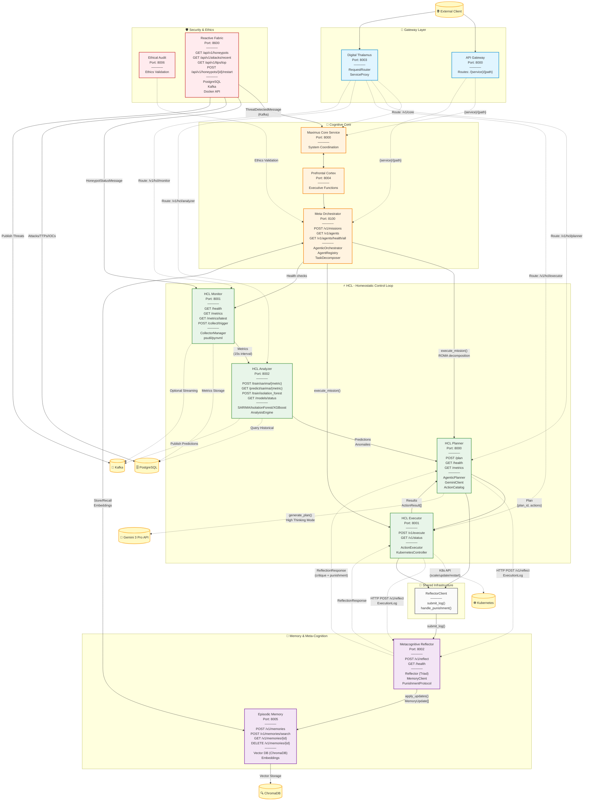

# Maximus 2.0 - Complete Architecture Diagram
> Baseado em auditoria completa do código fonte (não README)
> Data: 2025-12-01

## Sistema Completo



## Fluxo de Dados Detalhado

### 1. HCL Loop Completo
```
Monitor (15s) → Collect Metrics → PostgreSQL
              ↓
Analyzer ← Fetch Historical → Train Models (SARIMA/IF/XGBoost)
              ↓
         Predictions → Planner (Gemini 3 Pro) → Actions
              ↓
         Executor → K8s API (scale/update/restart)
              ↓
         Results → Reflector (Triad Check)
```

### 2. Reflection Workflow (NEW Integration)
```
Planner.recommend_actions() → ExecutionLog → HTTP POST /v1/reflect
                                                      ↓
                                            Reflector.analyze_log()
                                                      ↓
                                            Triad (Truth/Wisdom/Justice)
                                                      ↓
                                            OffenseLevel → Punishment
                                                      ↓
                                            MemoryUpdates → EpisodicMemory
                                                      ↓
                                       ReflectionResponse ← HTTP 200
```

### 3. Meta-Orchestrator Mission
```
POST /v1/missions → TaskDecomposer (ROMA) → Subtasks
                                                  ↓
                                    AgentRegistry.route_task()
                                                  ↓
                          ┌─────────────┬──────────────┬────────────┐
                          ↓             ↓              ↓            ↓
                    HCL Planner   HCL Executor   HCL Monitor   Memory
                          ↓             ↓              ↓            ↓
                          └─────────────┴──────────────┴────────────┘
                                                  ↓
                                    Synthesize Results → Response
```

## Endpoints Resumo (Código Real)

| Service | Port | Endpoints Principais |
|---------|------|----------------------|
| **API Gateway** | 8000 | `/{service}/{path}` (proxy), `/health` |
| **Digital Thalamus** | 8003 | Routes to all services |
| **Meta Orchestrator** | 8100 | `POST /v1/missions`, `GET /v1/agents`, `GET /v1/agents/health/all` |
| **HCL Monitor** | 8001 | `/health`, `/metrics`, `/metrics/latest`, `POST /collect/trigger` |
| **HCL Analyzer** | 8002 | `POST /train/sarima/{metric}`, `GET /predict/sarima/{metric}`, `/models/status` |
| **HCL Planner** | 8000 | `POST /plan`, `/health`, `/metrics` |
| **HCL Executor** | 8001 | `POST /v1/execute`, `GET /v1/status` |
| **Metacognitive Reflector** | 8002 | `POST /v1/reflect`, `/health` |
| **Episodic Memory** | 8005 | `POST /v1/memories`, `POST /v1/memories/search`, `GET /v1/memories/{id}`, `DELETE /v1/memories/{id}` |
| **Reactive Fabric** | 8600 | `/api/v1/honeypots`, `/api/v1/attacks/recent`, `/api/v1/ttps/top`, `POST /api/v1/honeypots/{id}/restart` |
| **Maximus Core** | 8000 | `/v1/*` (coordination) |
| **Prefrontal Cortex** | 8004 | `/v1/*` (executive functions) |
| **Ethical Audit** | 8006 | Ethics validation |

## Classes Principais (Código Real)

| Service | Core Classes |
|---------|--------------|
| **Meta Orchestrator** | `Orchestrator`, `AgentRegistry`, `TaskDecomposer` |
| **HCL Planner** | `AgenticPlanner`, `GeminiClient`, `ActionCatalog` |
| **HCL Executor** | `ActionExecutor`, `KubernetesController` |
| **HCL Analyzer** | `AnalysisEngine`, `ModelRegistry` (SARIMA, IsolationForest, XGBoost) |
| **HCL Monitor** | `CollectorManager` (psutil, pynvml) |
| **Reflector** | `Reflector`, `MemoryClient`, `PhilosophicalCheck` |
| **Digital Thalamus** | `RequestRouter`, `ServiceProxy` |
| **Episodic Memory** | Vector DB client (ChromaDB) |
| **Reactive Fabric** | Database layer (asyncpg), Kafka producer (aiokafka) |
| **Shared** | `ReflectorClient` (shared utility) |

## Dependências Externas

- **Gemini 3 Pro API**: HCL Planner (thinking mode)
- **Kubernetes API**: HCL Executor (deployments, pods, resources)
- **PostgreSQL**: HCL Monitor, Reactive Fabric
- **ChromaDB**: Episodic Memory (vectors)
- **Kafka**: HCL Analyzer, Reactive Fabric (streaming)
- **Docker API**: Reactive Fabric (honeypot health)

## Status da Integração

✅ **COMPLETO**:
- HCL Loop (Monitor → Analyzer → Planner → Executor)
- Reflection Integration (Planner + Executor → Reflector)
- Meta Orchestrator (ROMA decomposition)
- Episodic Memory (store/recall)
- Reactive Fabric (threat detection)

⏸️ **PENDENTE**:
- Gemini 3 Pro real API calls (placeholder logic exists)
- Kubernetes real deployment (mock K8s controller)
- Kafka real streaming (optional enabled)
- Full MIRIX memory integration (6 types)
