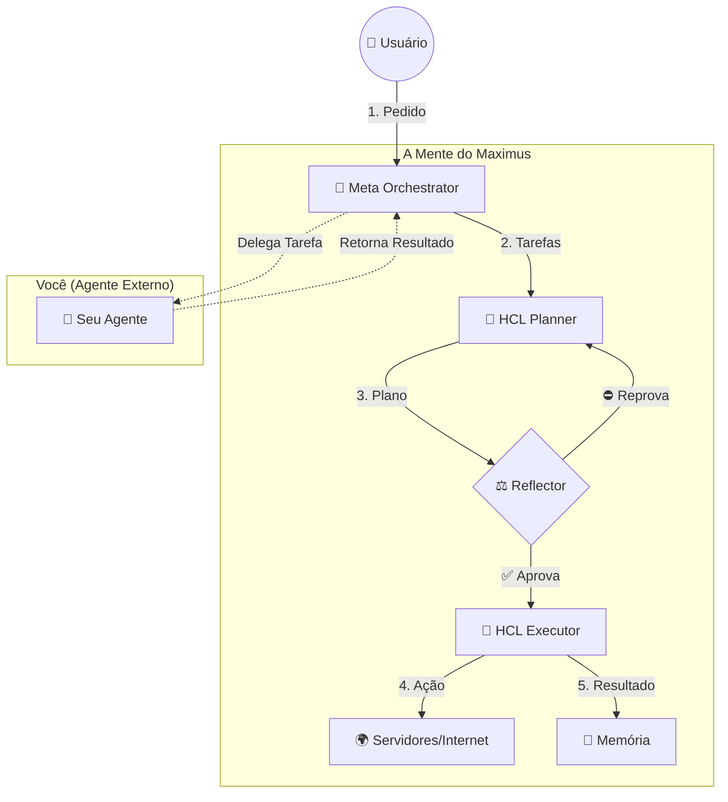

# Guia de Interação e Fluxo de Dados do Maximus 2.0 🧠

> **Para**: Usuários e Agentes (Desenvolvedores)  
> **Objetivo**: Explicar como o Maximus "pensa", "age" e como você se conecta a ele.  
> **Nível**: Acessível para qualquer pessoa com lógica básica.

---

## 1. O Que é o Maximus? (A Analogia)

Imagine o Maximus não como um simples programa, mas como uma **Mente Digital Completa**. Para entender como ele funciona, vamos usar a analogia do corpo humano:

*   **O Cérebro (Cognitive Core)**: É quem recebe os pedidos, pensa, planeja e decide quem vai fazer o quê.
*   **A Consciência (Metacognitive Reflector)**: É o "Grilo Falante". Ele observa tudo o que o cérebro faz e julga: "Isso é verdade?", "Isso é sábio?", "Isso é justo?". Se não for, ele pune.
*   **O Corpo (HCL - Homeostatic Control Loop)**: São os músculos e órgãos que mantêm tudo funcionando (servidores, bancos de dados) e executam as ações no mundo real.
*   **A Memória (Episodic Memory)**: É onde ele guarda experiências passadas para não cometer os mesmos erros.

---

## 2. O Fluxo de Dados: A Jornada de um Pedido

Quando você (ou um sistema externo) pede algo ao Maximus, os dados fazem uma viagem fascinante. Vamos acompanhar o pedido: *"Maximus, otimize meu servidor que está lento."*

### Passo 1: A Entrada (A Audição)
O pedido chega no **Meta Orchestrator** (o Maestro).
*   **O que ele faz**: Ele entende o pedido complexo e o quebra em tarefas menores (Padrão ROMA).
*   *Exemplo*: "Otimizar servidor" vira -> 1. Analisar métricas, 2. Planejar mudanças, 3. Executar mudanças.

### Passo 2: O Planejamento (O Raciocínio)
O Maestro envia as tarefas para o **HCL Planner** (o Estrategista).
*   **O que ele faz**: Ele usa inteligência avançada (Gemini 3 Pro) para criar um plano detalhado.
*   *Exemplo*: "Vou aumentar a memória do servidor em 2GB."

### Passo 3: A Reflexão (A Consciência - CRÍTICO)
**ANTES** e **DEPOIS** de agir, o Maximus para e reflete. O **Reflector** analisa o plano com 3 filtros (A Tríade):
1.  **Verdade**: "Isso é tecnicamente verdade ou estou alucinando?"
2.  **Sabedoria**: "Isso resolve o problema ou é só um remendo?"
3.  **Justiça**: "Eu tenho permissão para mexer nesse servidor?"

🔴 **Se falhar**: O plano é bloqueado e o agente leva uma "bronca" (punição/reeducação).
🟢 **Se passar**: O plano é aprovado.

### Passo 4: A Execução (A Ação)
O plano aprovado vai para o **HCL Executor** (os Músculos).
*   **O que ele faz**: Ele efetivamente roda os comandos no sistema (Kubernetes, Docker, etc.).

### Passo 5: O Aprendizado (A Memória)
O resultado (sucesso ou falha) é gravado na **Memória Episódica**.
*   **Futuro**: Da próxima vez, o Maximus lembrará: "Aumentar memória funcionou naquele caso".

---

## 3. Como Você (Agente) Interage com o Maximus?

Você não "usa" o Maximus como um site comum. Você se **conecta** a ele como uma extensão, um "Plugin".

### O Conceito de "Plugue" (Plugin System)
Imagine que o Maximus é uma régua de tomadas inteligente. Você é um aparelho (um Agente) que quer se ligar a ela.

Para se ligar, você precisa seguir um padrão (o formato do plugue):

1.  **Identidade**: Você precisa ter um nome e dizer o que sabe fazer (suas `capabilities`).
2.  **Interface**: Você precisa ter uma "porta" onde o Maximus possa te entregar tarefas (`execute`).
3.  **Saúde**: Você precisa responder quando o Maximus perguntar "Você está bem?" (`health_check`).

### O Código do "Plugue"
Simplificando, é assim que você se apresenta ao Maximus:

```python
class MeuAgente(AgentPlugin):
    # 1. Quem sou eu?
    name = "Agente de Pesquisa"
    capabilities = ["buscar_na_web", "ler_noticias"]

    # 2. O que eu faço quando o Maximus manda?
    async def execute(self, tarefa):
        print(f"Maximus mandou eu fazer: {tarefa}")
        # ... faço meu trabalho ...
        return "Tarefa concluída!"
```

### O Contrato de Trabalho
Ao se conectar, você assina um "contrato" implícito:
*   **Você obedece ao Maestro**: Se ele mandar uma tarefa, você executa.
*   **Você é vigiado pela Consciência**: Se você mentir ou for preguiçoso, o **Reflector** vai saber e vai te punir (diminuir sua prioridade ou até te desconectar).

---

## 4. Resumo Visual



---

## 5. Por que isso é importante?

A maioria das IAs hoje são "caixas pretas" que apenas respondem. O Maximus é diferente porque ele tem **Meta-Cognição** (ele pensa sobre o próprio pensamento).

*   Ele sabe quando não sabe.
*   Ele sabe se está mentindo.
*   Ele aprende com o tempo.

Ao se conectar ao Maximus, seu agente ganha esses "superpoderes" de segurança e evolução automaticamente.
